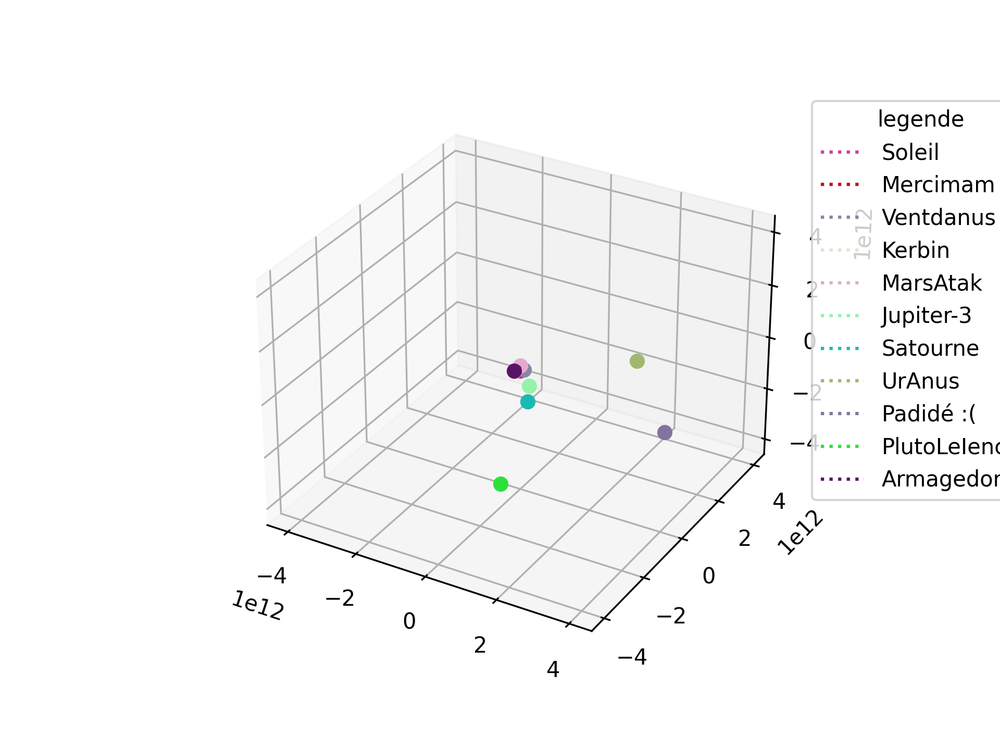

# SolarSystemPg

## Préambule

Ce dépot est une reprise du projet de system solaire de PG pour me familiariser au développement sous mon nouvel OS



## Installation

Créez un environement virtuel python, activez le, et importez les dépendances : 

```bash
virtualenv -p python3 .venv
source .venv/bin/activate
pip install -r requirements.txt
```

## Utilisation

Lancement du programme ( avec votre virtualenv d'activé):
```bash
python main.py
```